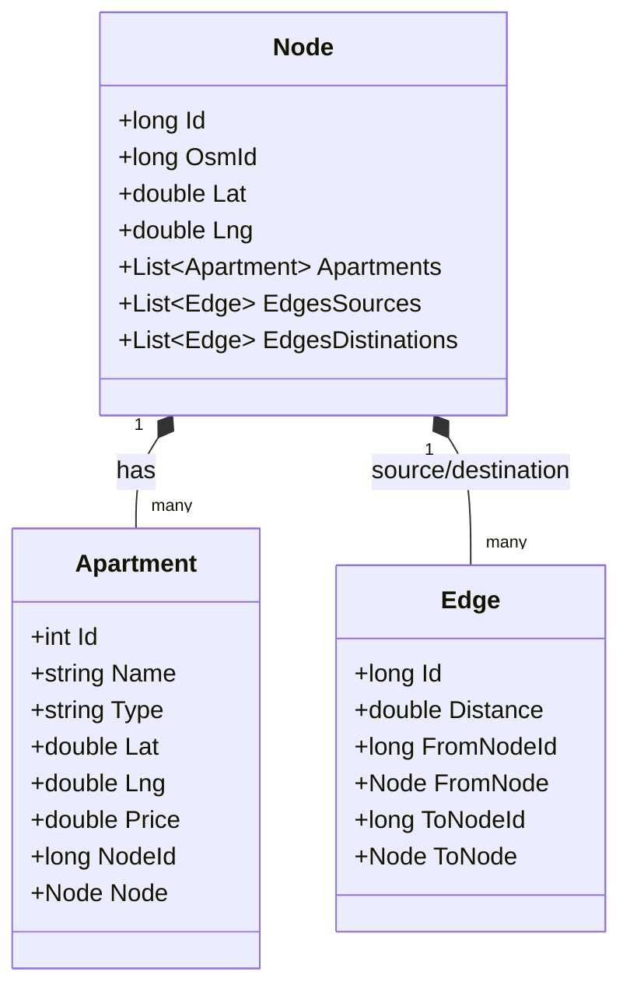

# 🗺️ NestFinder: Smart Route Planner

NestFinder is a GIS-powered, full-stack web application designed to find and route the closest apartments to a user-selected location. Instead of relying on straight-line Euclidean calculations, the application utilizes graph theory and real-world road networks to compute accurate walking or driving routes.

The platform automatically seeds its database with actual geographic data from **OpenStreetMap (OSM)** and calculates shortest-path networks using a custom implementation of **Dijkstra's Algorithm** in .NET 8.

---

## 🚀 Key Features

* **Interactive Location Picker:** Drop a pin anywhere on a premium dark-themed **Leaflet.js** map to set your search origin.
* **Graph-Based Shortest Paths:** Calculates proximity using the actual street grid via a custom **Dijkstra's Algorithm** implementation.
* **Dynamic Route Visualization:** Fetches and overlays precise driving paths on the map in real-time by integrating the **OSM (Open Source Routing Machine)** API.
* **Automated Geographic Seeding:** Dynamically queries the **Overpass API** during database initialization to import real road-network nodes and highways for a specified bounding box, linking test apartments to the nearest street graph intersections.
* **Sleek UI/UX:** Built with modern CSS custom properties, glassmorphism elements, custom icons, and responsive layouts.

---

## 🛠️ Tech Stack & Architecture

### Backend
* **Runtime:** .NET 8.0 & C# 12
* **Framework:** ASP.NET Core MVC (Controller-Service-Repository Pattern)
* **Database & ORM:** SQL Server with **Entity Framework Core 8**
* **Algorithms:** Dijkstra's Shortest Path Algorithm leveraging .NET's high-performance `PriorityQueue<TElement, TPriority>`
* **Spatial Calculations:** **Haversine Formula** for computing geographical distances between coordinates

### Frontend
* **Mapping Library:** **Leaflet.js** with CartoDB Dark Matter tiles
* **Routing API:** **OSRM API** for retrieving driving coordinates
* **Styling:** Bootstrap 5 & Custom Vanilla CSS (Dark Mode theme with glowing accents)

---

## 📐 Database Schema & Graph Modeling

The project maps the geographic street grid into a relational graph structure in SQL Server using the following entities:

1. **Node:** Represents a geographic coordinate intersection (`Lat`, `Lng`) imported from OpenStreetMap.
2. **Edge:** Represents a street segment connecting two nodes. It includes a self-referential relationship (`FromNode` / `ToNode`) and stores the physical weight (`Distance`) computed using the Haversine formula.
3. **Apartment:** Represents a rental property containing price, type, and geographic coordinates. Each apartment is mapped directly to the nearest network `Node` on the graph for route planning.



---

## ⚡ How it Works: Dijkstra & GIS Routing

### 1. Seeding the Network
On initial startup, `SeedService` posts an Overpass QL query to download highways within a bounding box (configured for New Damietta, Egypt):
```overpass
[out:json];
(
  way["highway"](31.38,31.65,31.45,31.72);
);
(._;>;);
out body;
```
* Coordinates are imported into the database as **Nodes**.
* Roads connecting these coordinates are converted into graph **Edges**, and their physical distance in meters is calculated using the **Haversine formula**.
* Test properties are randomly created and attached to the closest node in the network.

### 2. Finding the Closest Properties
When you click the map:
1. The application finds the closest network node to your pinned location.
2. It runs **Dijkstra's shortest path algorithm** to compute the actual street-network distance from that node to all apartments.
3. Results are returned sorted by real road distance rather than straight-line distance.